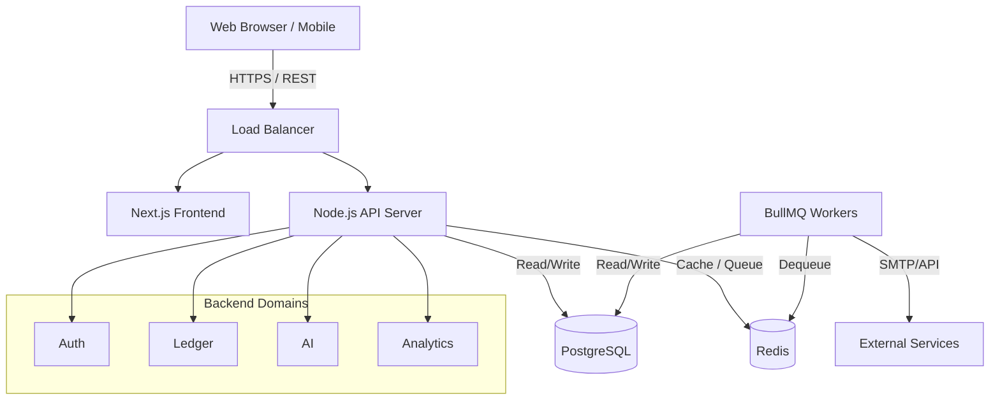
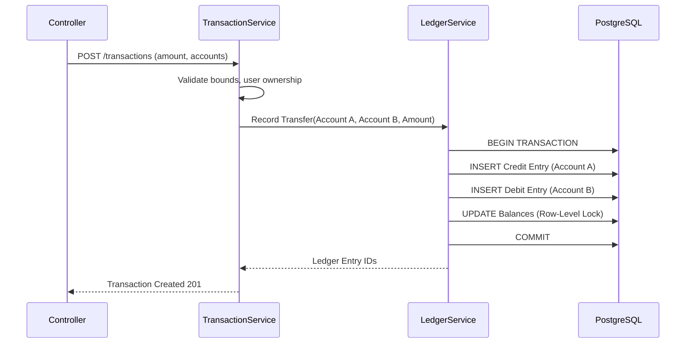

# Finora Production Architecture

## 1. System Overview

Finora follows a modular monolithic architecture, providing the logical separation of microservices while maintaining the operational simplicity of a single deployable backend unit. It consists of a Next.js frontend, an Express.js/Node.js API, a PostgreSQL relational database, and Redis for caching and background job queuing (via BullMQ).

## 2. High-Level Architecture Diagram

## 3. Frontend Architecture
- **Framework**: Next.js (App Router) for hybrid static & server rendering.
- **State Management**: TanStack Query for server state caching; React Context for global UI state.
- **UI & Styling**: Tailwind CSS with shadcn/ui for accessible, reusable components.
- **Form Validation**: React Hook Form combined with Zod for strict type-safe validation matching backend schemas.
- **Data Visualization**: Recharts for dynamic financial dashboards and motion for micro-animations.

## 4. Backend Architecture
- **Framework**: Express.js with TypeScript.
- **Pattern**: Layered Architecture (Controller -> Service -> Repository).
- **Service Boundaries**: The application is divided into highly cohesive domain modules. Cross-domain communication happens via injected Services rather than direct DB access.

### Domain Modules
- **auth**: JWT issuing, password hashing, session management.
- **users**: Profile management, preferences, onboarding state.
- **accounts**: Depository, credit, and investment account aggregates.
- **transactions**: User-facing transaction records and categorization.
- **ledger**: Immutable double-entry bookkeeping engine (debits/credits).
- **categories**: Master and user-defined category trees.
- **budgets**: Spending thresholds and period-based consumption.
- **goals**: Savings targets and milestone tracking.
- **investments**: Portfolio holdings and historical performance.
- **analytics**: Aggregation engine for cashflow and net worth.
- **forecasting**: Projection logic based on historical run-rates.
- **notifications**: In-app and email alert preferences and dispatch.
- **reports**: PDF/CSV generation logic.
- **ai**: LangChain/LLM integration with strict function-calling boundaries.
- **audit**: Immutable logging of sensitive operations.

### Layer Definitions
- **Controllers**: Handle HTTP routing, extract payloads, pass to services, format responses.
- **Services**: Contain business logic, orchestrate repositories, enforce domain rules.
- **Repositories**: Encapsulate all Data Access Logic (Prisma/Kysely or raw SQL) to interact with PostgreSQL.
- **DTOs/Schemas**: Zod definitions shared between frontend and backend for I/O validation.
- **Events**: Internal pub/sub (EventEmitter) for decoupling side-effects (e.g., `TransactionCreated` -> triggers `BudgetCheck` and `AnalyticsInvalidation`).

## 5. API Architecture
- **Paradigm**: RESTful JSON API.
- **Versioning**: URI-based (e.g., `/api/v1/transactions`).
- **Standardization**: JSend standard for responses (status, data, message).

## 6. Database Architecture
- **Engine**: PostgreSQL 16+.
- **Design**: 3rd Normal Form (3NF) for transactional integrity.
- **Migrations**: Declarative schema management tracked in version control.

## 7. Authentication & Authorization
- **Auth**: Stateless JWTs. Access tokens (15m expiry) and opaque Refresh tokens (7d expiry) stored in HttpOnly, Secure cookies.
- **Authorization**: Role-Based Access Control (RBAC) at the route level. Row-Level Security (RLS) or application-level ownership assertions (e.g., `WHERE user_id = $1`) on every query to prevent IDOR.

## 8. Financial Ledger & Transaction Processing

- **Immutability**: Ledger entries cannot be DELETED. They can only be reversed by an offsetting entry.
- **Concurrency**: Operations affecting balance use `SELECT ... FOR UPDATE` to avoid race conditions.

## 9. Background Job Architecture
- **Queue**: BullMQ backed by Redis.
- **Workers**: Separate Node processes or threads consuming jobs.
- **Queues**:
  - `email-queue`: Async SMTP delivery.
  - `report-queue`: Heavy PDF generation.
  - `ai-insight-queue`: Background calculation of financial anomalies.

## 10. AI Architecture
- **Pattern**: Tool/Function Calling via OpenAI/Anthropic SDKs.
- **Constraint Mechanism**: The LLM does NOT execute SQL. It is provided deterministic functions (e.g., `getAccountBalance(accountId)`).
- **Context Window**: System prompts enforce "Do not invent data. If you lack context, ask the user."

## 11. Analytics & Reporting Architecture
- **Analytics**: Pre-aggregated material views (or scheduled roll-ups) for fast dashboard rendering.
- **Reporting**: Worker-based execution generating artifacts stored temporarily in cloud object storage (or local tmp in dev), then streamed to the client.

## 12. Caching Strategy
- **Layer**: Redis.
- **Targets**: Static reference data (categories), user preferences, and heavy analytical roll-ups.
- **Invalidation**: Event-driven (e.g., `TransactionCreated` event clears `/analytics/net-worth` cache for that user).

## 13. Error Handling & Observability
- **Error Handling**: Global error middleware catching `AppError` subclasses (e.g., `ValidationError`, `NotFoundError`).
- **Observability**: Structured JSON logging (Pino) and basic correlation IDs passed through headers for request tracing.

## 14. Security Threat Model
- **Injection**: Prevented via parameterized queries / ORM.
- **XSS**: Mitigated by React's auto-escaping and strict CSP headers.
- **CSRF**: Mitigated by SameSite=Strict cookies.
- **Rate Limiting**: IP and User-based limiting using Redis.

## 15. Deployment Architecture
- **Containerization**: Dockerized Node.js app and workers.
- **CI/CD**: GitHub Actions running linting, Vitest, Playwright, and building Docker images.

---

## Architecture Decision Records (ADRs)

### ADR 001: Monolithic over Microservices
- **Decision**: Use a Modular Monolith.
- **Tradeoffs**: Faster development, easier deployment, and no network latency between domains. Sacrifices independent scalability of domains, which is acceptable for a portfolio project.

### ADR 002: Integer-based Currency Storage
- **Decision**: Store all monetary values as integers representing the smallest unit (e.g., cents).
- **Tradeoffs**: Requires division/multiplication on the frontend/API boundary, but completely eliminates IEEE 754 floating-point rounding errors ensuring 100% financial accuracy.

### ADR 003: Double-Entry Ledger System
- **Decision**: Separate user-facing "Transactions" from immutable "Ledger Entries" (Debits/Credits).
- **Tradeoffs**: Significantly increases complexity of the insert/update logic, but guarantees financial integrity and provides an audit trail necessary for production-grade fintech apps.
